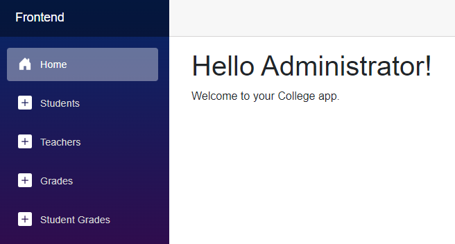
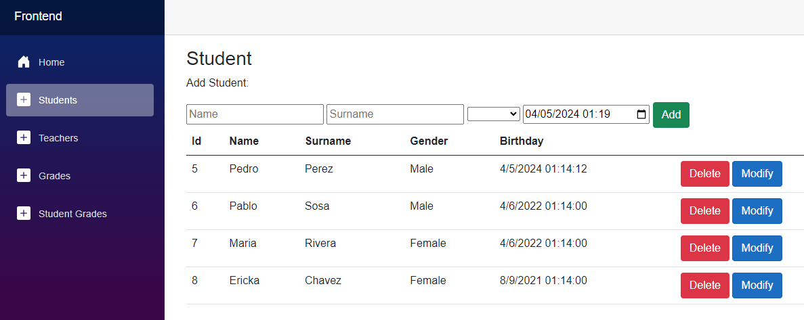
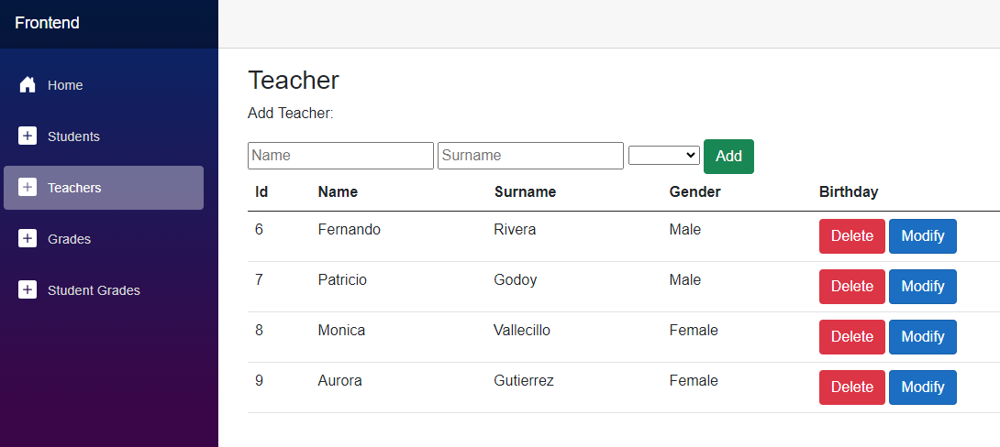
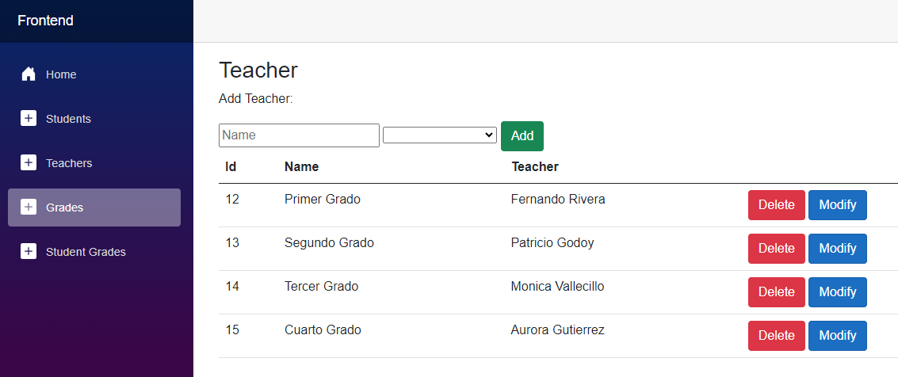
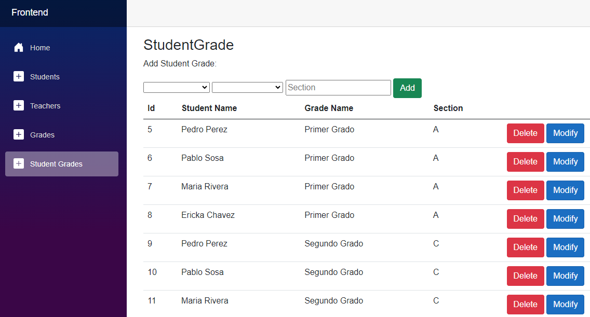
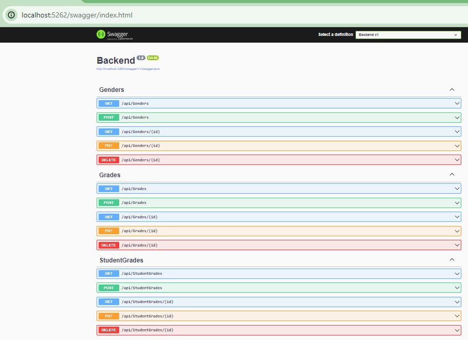

# College Application

This project is a light College management system developed with Blazor and ASP.NET Core. It allows performing CRUD (Create, Read, Update, Delete) operations on a SQL Server database of students.

## Prerequisites

- Visual Studio or Visual Studio Code
- .NET SDK
- Internet connection to access the genders and students API

## Setup

1. Clone this repository to your local machine.
2. Open the project in Visual Studio or Visual Studio Code.
3. Restore NuGet packages and build the solution.
4. Ensure that the genders and students API is up and running and accessible at `http://localhost:5262/api/Genders` and `http://localhost:5262/api/Students`, respectively.
5. Run the application and test out the different functionalities of the system.

## Features

- **Web API**
- **Students**
- **Teachers**
- **Grades**
- **Student Grades**

## Author

This project was created by [Fernando Evelio Rivera](https://github.com/fernandorivdev/).

## License

This project is licensed under the [MIT License](LICENSE).

## Images

